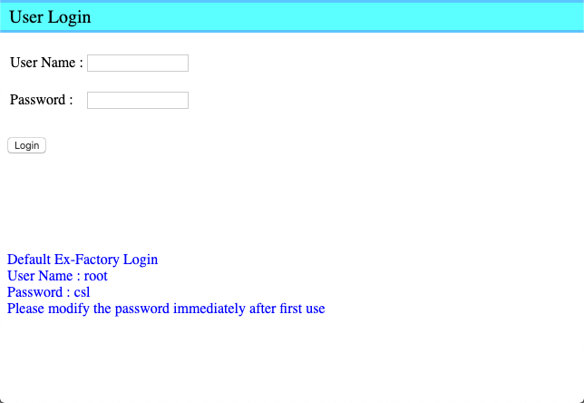
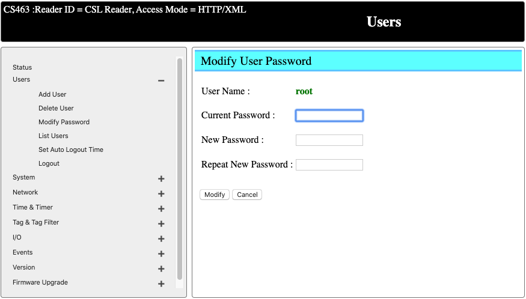
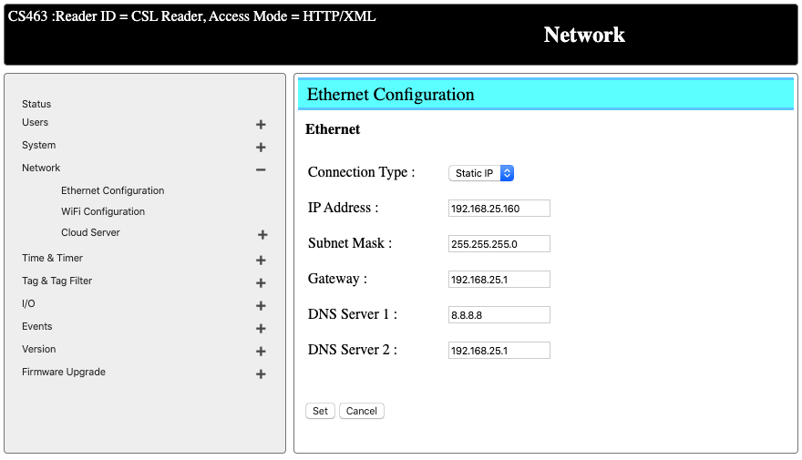
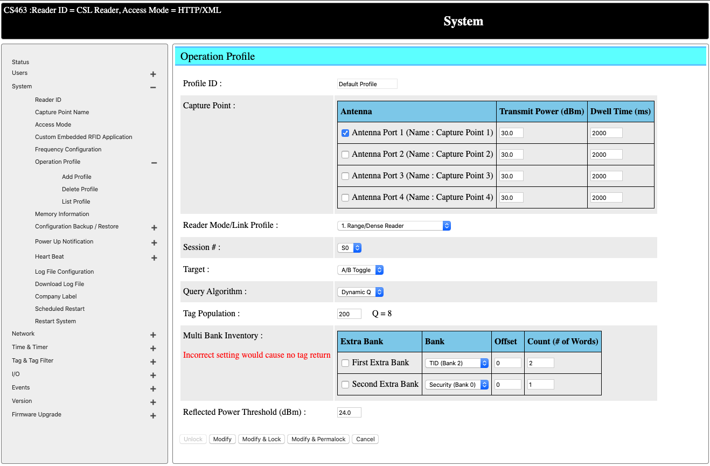
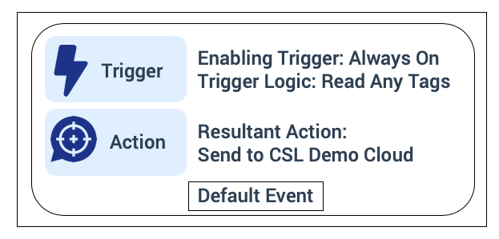
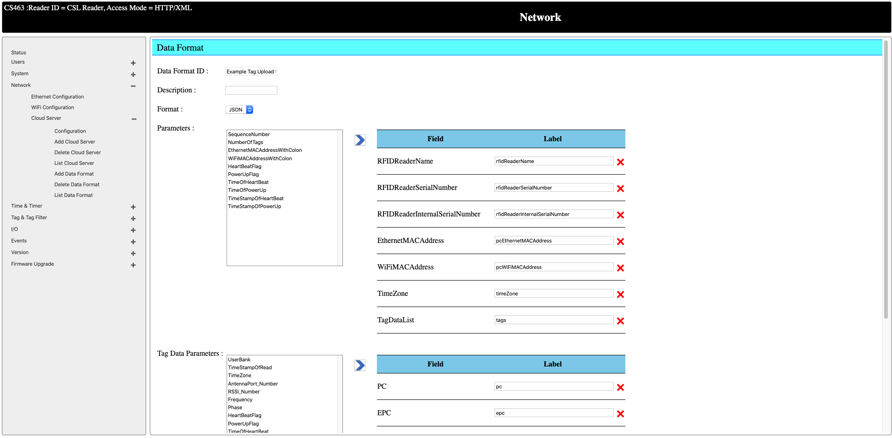
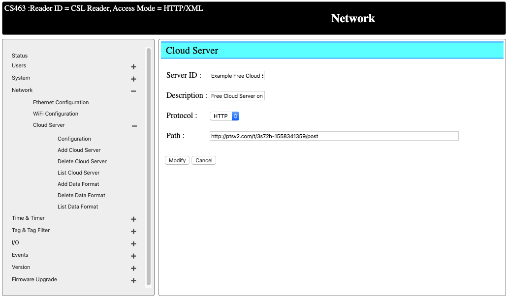
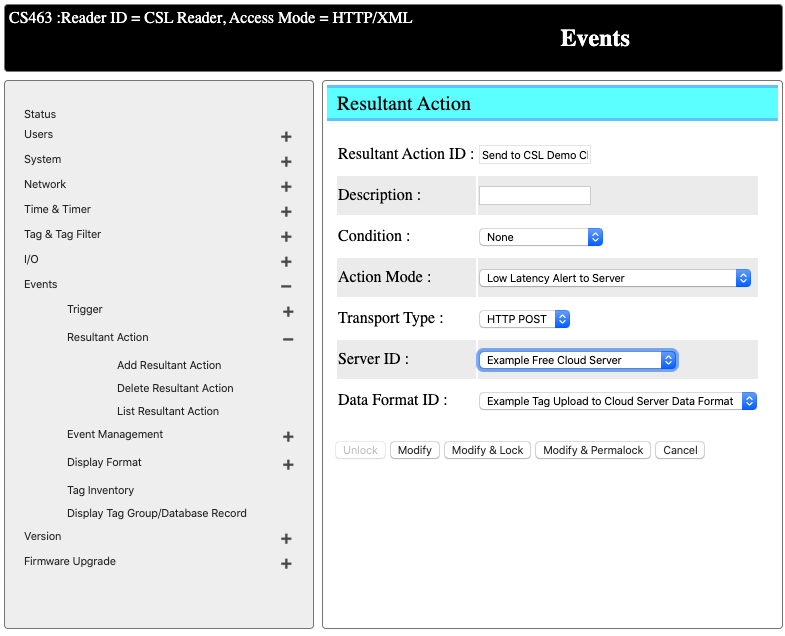
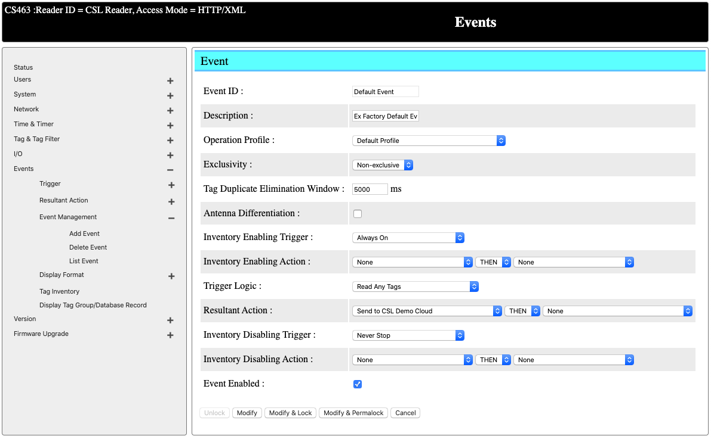
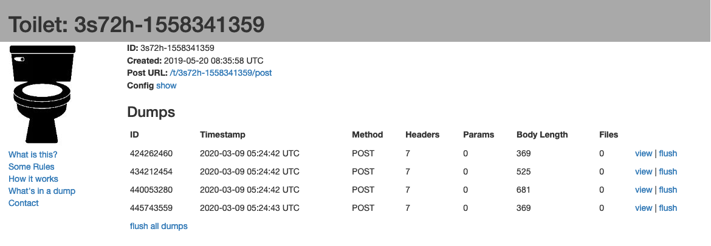

**Objectives:** 

* To set up your reader trying and start reading tags with minimal configurations
* Display tag data on web interface
* Define your tag data format
* Send tag data to a remote HTTP server

**Technical Level:** Beginning (operate your web browser)

**Prerequisits:** None

**Recipe:**

1. [Power Up Reader and Access Web Interface](#1)
2. [Log in with Default Password](#2)
3. [Change the Default Password](#3)
4. [Change the IP address](#4)
5. [Change Power, Antenna and RFID Settings (Operation Profile)](#5)
6. [The Concept of Events](#6)
7. [Define a Tag Data Format](#7)
8. [Configure a Cloud Server to Receiving Tag Data](#8)
9. [Configure the Resultant Action to Send to the Cloud Server Specified](#9)
10. [Enable Default Event to Start Reading Tags](#10)
11. [Check Tag Data on the Server](#11)

## Power Up Reader and Access Web Interface

Your reader has an IP address of 192.168.25.160 by default.  You will first need to change the IP address of your computer to be within the same subnet (i.e 192.168.25.100) so that you can access the reader.

## Log in with Default Password

Once your computer is connected to the same subnet as the reader, you can type in http://192.168.25.160 to access the web interface of the reader.

You can log in with the default username and password on the screen.

## Change the Default Password

It is important to change the default password after the first log-in.  You can do that by going to `User -> Modifiy Password`

## Change the IP address

As you might have changed the IP address of your computer to get connected, you can change the 
Once you get connected, go to `Network -> Ethernet Configurations`.  Change the IP address to reader to the intended network.  After this, you can change the IP address of your computer to the original value and reconnect.

## Change Power, Antenna and RFID Settings (Operation Profile)

You can now configure the reader by going to `System -> Operation Profile -> List Profile` for a listing of all the profiles.

You can create a specific profile, or you can reconfigure the default profile to fulfill your needs.

Select `Default Profile` to edit.

You can enable/disable the antenna port based on the antenna you needed/connected for the application.

Power of each of the antenna can be adjusted accordingly.

Dwell time represents the duration an antenna port will be read before switch or the next port.

You can change the tag population based on the estimated number of tags to be read in the field.

All other parameters are standard UHF RFID configurations.  You can leave them unchanged for now.

Click on modify to update the settings.

## The Concept of Events

The reader has a built-in event engine to carry out operations when specific logics are being triggered.  Users can create events based on their needs.

Each event consists of two components:

* Trigger
* Action

Trigger can be mapped any of the following items:

* Read Any Tags
* Input Sensor State
* No Tag Read in Specific Time Span
* Trigger in Tag Group
* Trigger in Tag Database
* Trigger if RSSI larger than or equal to
* Specified Time Span elapsed

Action can be mapped to any of the following items:

* Do nothing (only show result on web interface)
* Batch Alert to Server
* Instant Alert to Server (No Duplicate Elimination)
* Low latency Alert to Server
* Output port (change the GPO state)
* Display Tag Database Record
* Display Tag Group Record

For this example, we can simply modify and enable the Default Event to start reading and send the tag data to a remote server.

## Define a Tag Data Format

After a tag is being read, it can be sent to a remote server in a user-defined format.

You can go to `Network -> Cloud Server -> List Data Format` to see the data format being defined.  You can create a new data format by going to `Add Data Format` or simple edit one of the existing format to fit you needs.  In this case, we update the existing tag data format `Example Tag Upload to Cloud Server Data Format` by adding/removing the data fields to be sent when a tag is being read.  Data can either be sent in JSON or XML format.

## Configure a Cloud Server to Receiving Tag Data

You can define a remote server, or simply a PC or receiving the tag data from the reader.  There are two types of cloud server:

* HTTP (reader will send HTTP post request to the server along with JSON/XML data in the tag format specified earlier)
* TCP (reader will create a TCP socket connection to the server over the port defined and send the JSON/XML data in the tag format specified earlier)

In our case, we can use the pre-defined `Example Free Cloud Server` on the reader, where it send all the HTTP POST request to a free HTTP server on Internet for simple trouleshooting and testing.

In this example, the server will to HTTP POST to the URL `http://ptsv2.com/t/3s72h-1558341359/post` and you can see the results over the URL `http://ptsv2.com/t/3s72h-1558341359`

## Configure a Resultant Action to Send Data to the Defined Cloud Server

You can go to `Event -> Resultant Action -> List Resultant Action` to see all the resultant actions being defined on the reader.  In our case, we are going to modify an existing resultant action - `Send to CSL Demo Cloud`.

We can change the Server ID to `Example Free Cloud Server` that we defined in the previous section.

For data format, we can change it to `Example Tag Uplaod to Cloud Server Data Format` that we defined in the previous section.

## Enable Default Event to Start Reading Tags

At last, we go to `Event -> Event Management -> List Event`.  Select `Default Event` and update the event details.

For triggering, we can leave everything as-is (Always On, Read Any Tags).  For resultant action, change to `Send to CSL Demo Cloud` and check the box for `Event Enabled`.  Click on `Modify` to update the event.

## Check Tag Data on the Server

To see the tag read on the web interface, you can go to `Event -> Tag Inventory`.

To see the tag read being sent to the HTTP server, you can go to the URL of the remote test server, in our case `http://ptsv2.com/t/3s72h-1558341359`.

For more details on the CS463 event engine, you can refer to the [CS463 User's Manual] (https://www.convergence.com.hk/downloads/cs463/). 