**Objectives:** 

* To install the software framework for rapid application development
* To allow users to deploy custom applications to the reader and enable remote debugging 
* To create an app with custom logics and receive tag data from the CS463 built-in event engine

**Technical Level:** Intermediate/Advanced

**Prerequisits:**

* CS463 basic operations
* CS463 access mode and event engine 
* Basic knowledge of Linux terminal and commands
* Understand the concpets of MQTT messaging and IoT
* Knowledge on Javascript, Node.js and Node-Red 

> Note: We strongly recommended to review the the following information before proceeding to the steps as all users have full access to the device by default.  Make sure you know what you are doing.
  
> 
> * [CS463 User's Manual](https://www.convergence.com.hk/downloads/cs463/)
> * [CS463 Getting Started Guide](../2020-03-26-cs463-getting-started)
> * [CS463 Configure your Edge Device for Hosting Custom Applications](../2020-03-26-cs463-edge-setup)

**Recipe:**

1. [Overview of CS463 IoT Stack](#1) 
2. [Install Node.js from the Repository](#2)
3. [Create a Test Application with Node.js](#3)
4. [Remote Debugging with Visual Studio Code](#4)
5. [Install Node-Red with NPM](#5)
6. [Create System Service to Start Node-Red on Start](#6)
7. [Enable Password Authentication on Node-Red](#7)
8. [Debug Javascript Function Node in Chrome Browser](#8)
9. [Install Eclipse Mosquitto MQTT Broker on the Reader](#9)
10. [Redirect Tag Data to MQTT Broker on Node-Red](#10)


## <a name="1"></a>Overview of CS463 IoT Stack 

CS463 has a rich set of hardware peripherals for users to have access to various sensors and networks (e.g. UHF RFID, Bluetooth, Wi-Fi, RS-232, USB, etc.)

Developers can run the CS463 reader as a Linux edge device and develop their own application on the reader, using various development framework and software libraries including:

* C# (Mono Runtime 6 or .NET Framework 4.7 compatible)
* Java (JRE 1.8)
* Javascript (Node.js v12 with NPM)
* Python (Python 3 with PIP)
* Version Control (Git)
* Visual Programming (Node-Red)
* MQTT Messaging (Eclipse Mosiqutto)
* Local storage (SQLite)

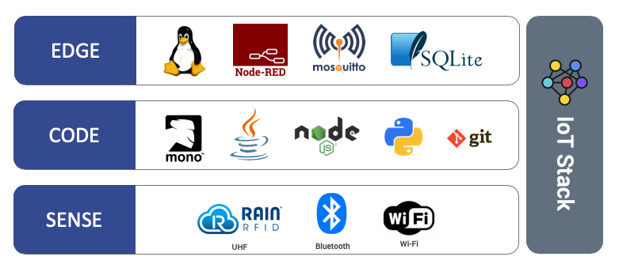

All these can be installed as DNF packages via the CS463 repository.  We assume your reader has reference to the repository on the preivous edge device configurations.

For this post, we are going to install Node.js and create a web server app on the reader with Javascript so that you can receive tag data from the CS463 event engine.

After that, we will install Node-Red, a visual programming tool based on Node.js on the reader.  It will further simplify the development process.

## <a name="2"></a> Install Node.js from the Repository

Install Node.js on your reader with the following command on Linux terminal:

`sudo dnf install node`

Please acknowledge the installation so that Node.js will be installed to your reader.

```
cs463-7b8400f6:~$ sudo dnf install node
Password: 
Last metadata expiration check: 9:40:13 ago on Tue Mar 10 15:59:56 2020.
Dependencies resolved.
=============================================================================================================================================================================
 Package                              Arch                                          Version                                    Repository                               Size
=============================================================================================================================================================================
Installing:
 node                                 imx6dlsabresd                                 12.14.0-1                                  cslrepo                                  21 M

Transaction Summary
=============================================================================================================================================================================
Install  1 Package

Total download size: 21 M
Installed size: 63 M
Is this ok [y/N]: y
Downloading Packages:
node-12.14.0-1.imx6dlsabresd.rpm                                                                                                             878 kB/s |  21 MB     00:24    
-----------------------------------------------------------------------------------------------------------------------------------------------------------------------------
Total                                                                                                                                        878 kB/s |  21 MB     00:24     
Running transaction check
Transaction check succeeded.
Running transaction test
Transaction test succeeded.
Running transaction
  Preparing        :                                                                                                                                                     1/1 
  Installing       : node-12.14.0-1.imx6dlsabresd                                                                                                                        1/1 
  Verifying        : node-12.14.0-1.imx6dlsabresd                                                                                                                        1/1 

Installed:
  node.imx6dlsabresd 12.14.0-1                                                                                                                                               

Complete!
cs463-7b8400f6:~$ 
```
## <a name="3"></a> Create a Test Application with Node.js 

You can create a web server application with Node.js to receive tag data from the CS463 event engine.

* Go you your home directory (`/home/cslrfid` in this case) and create the folder `nodejsTestApp`
* Within the folder, create and edit the file using editor `nano server.js` with nano editor
* Paste the code below for creating a web server on the reader to receive http post request at port 3000

```
const http = require("http");

const hostname = "0.0.0.0";
const port = 3000;

const server = http.createServer((req, res) => {
  console.log(`\n${req.method} ${req.url}`);
  console.log(req.headers);

  req.on("data", function(chunk) {
    console.log("BODY: " + chunk);
  });

  res.statusCode = 200;
  res.setHeader("Content-Type", "text/plain");
  res.end("Hello World\n");
});

server.listen(port, hostname, () => {
  console.log(`Server running at http://localhost:${port}/`);
});
```

* At the terminal, run `node server.js` to start the Node.js app.
* Log into the CS463 web interface.  To go `Network -> Cloud Server -> List Cloud Server`.  Select the cloud server that is currently active.
* Change the path to `http://127.0.0.1:3000` so that all tag data will be redirected to the local Node.js app. 

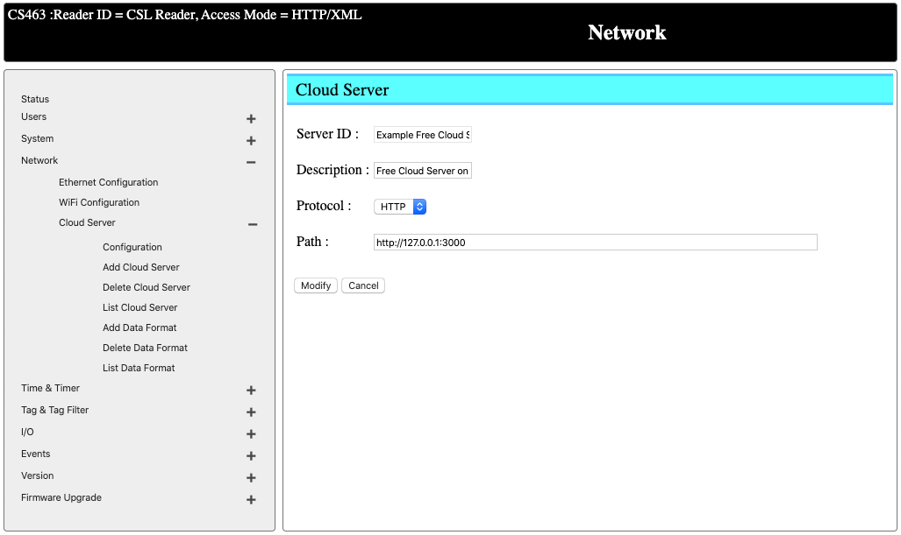

* Back to the terminal with the app running, you should see tag data being returned as http post request.
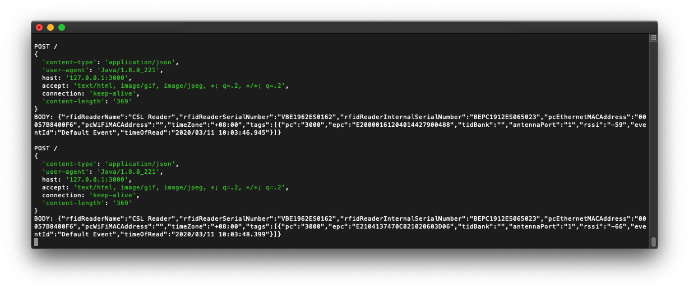

## <a name="4"></a> Remote Debugging with Visual Studio Code

For larger-scale development, you might want to have the development environment on your computer and develop, compile and deploy the code to the reader and debug the code remotely.  You can do that with Visual Studio Code via remote debugging.  VS Code is a cross-platform tool that is avaiable for Windows, MacOS and Linux.

1. Download [VS Code] (https://code.visualstudio.com/) for free and install on your computer
2. Map the working folder on the reader to your computer using sshfs.  In our case, we are mapping the folder `/home/cslrfid/nodejsTestApp` to our local folder in the same name under our home directory.

```
sshfs -o allow_other,default_permissions cslrfid@cs463-7b8400f6.local:/home/cslrfid/nodejsTestApp ~/nodejsTestApp/
```
3. Launch VS Code and go to `File -> Open...`.  Select the folder being mapped above
4. You can now see the files on your reader on VS Code
5. Select the Debug tab and click on the "gear" icon to create a new launch.json file.  Select "node" as your language
6. On the launch.json file being generated, add the following configuration for remote debugging.  Fill in the hostname/IP address of your reader.
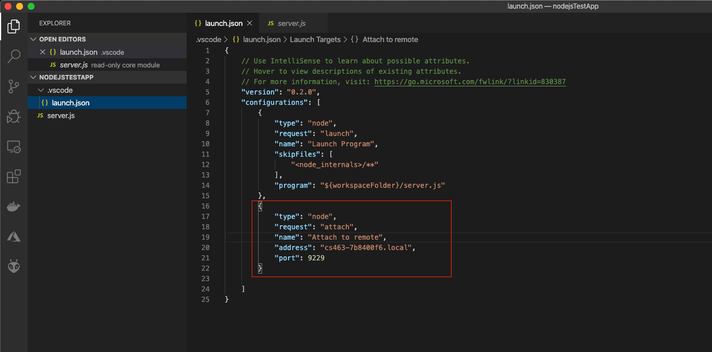
7. On the VS Code terminal, ssh into the reader and run your app on the reader with the following command:
```
node —inspect-blk=cs463-7b8400f6.local:9229 server.js
```
8. You can now select the `Attach to remote` configuration on VS Code to start debugging.  The VS Code debugger will be attached to the app running on the reader remotely.  You can put in breakpoint to at the lines that you would like.
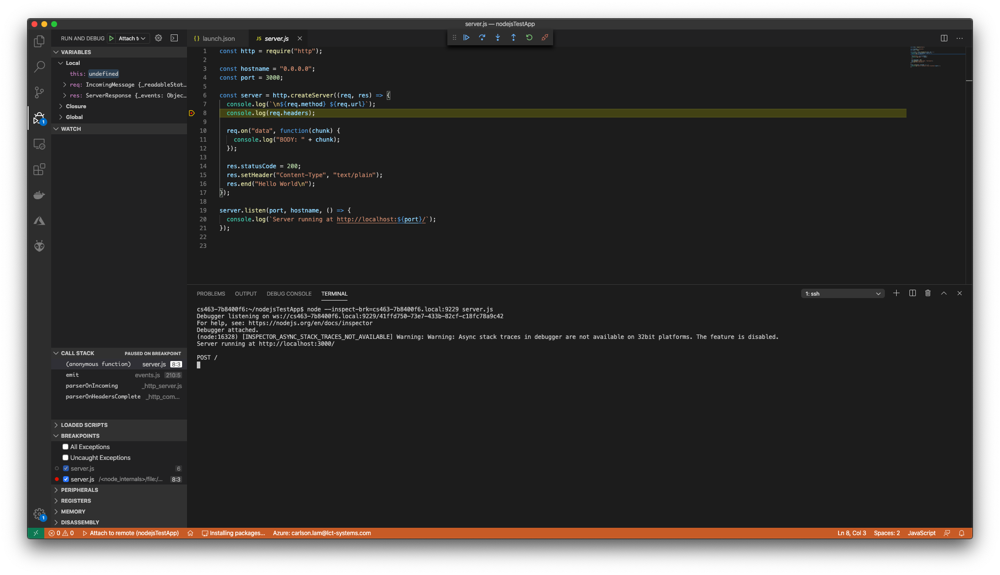
 
## <a name="5"></a> Install Node-Red with NPM

Node-Red is a visual programming tool built with Node.js.  It can reduce the code you need to write and it is architected for the IoT world.

To install Node-Red, you can run the command `sudo npm install -g --unsafe-perm node-red`.

```
cs463-7b8400f6:~$ sudo npm install -g --unsafe-perm node-red
Password: 
npm WARN deprecated request@2.88.0: request has been deprecated, see https://github.com/request/request/issues/3142
/usr/local/bin/node-red -> /usr/local/lib/node_modules/node-red/red.js
/usr/local/bin/node-red-pi -> /usr/local/lib/node_modules/node-red/bin/node-red-pi

> bcrypt@3.0.6 install /usr/local/lib/node_modules/node-red/node_modules/bcrypt
> node-pre-gyp install --fallback-to-build

node-pre-gyp WARN Using request for node-pre-gyp https download 
node-pre-gyp WARN Tried to download(404): https://github.com/kelektiv/node.bcrypt.js/releases/download/v3.0.6/bcrypt_lib-v3.0.6-node-v72-linux-arm-glibc.tar.gz 
node-pre-gyp WARN Pre-built binaries not found for bcrypt@3.0.6 and node@12.14.0 (node-v72 ABI, glibc) (falling back to source compile with node-gyp) 
make: Entering directory '/usr/local/lib/node_modules/node-red/node_modules/bcrypt/build'
  CXX(target) Release/obj.target/bcrypt_lib/src/blowfish.o
  CXX(target) Release/obj.target/bcrypt_lib/src/bcrypt.o
  CXX(target) Release/obj.target/bcrypt_lib/src/bcrypt_node.o
  SOLINK_MODULE(target) Release/obj.target/bcrypt_lib.node
  COPY Release/bcrypt_lib.node
  COPY /usr/local/lib/node_modules/node-red/node_modules/bcrypt/lib/binding/bcrypt_lib.node
  TOUCH Release/obj.target/action_after_build.stamp
make: Leaving directory '/usr/local/lib/node_modules/node-red/node_modules/bcrypt/build'
+ node-red@1.0.4
added 334 packages from 340 contributors in 153.213s
cs463-7b8400f6:~$
```

## <a name="6"></a> Create System Service to Start Node-Red on Start

After Node-Red is installed, you can create a service to run Node-Red on start

```
sudo nano /etc/systemd/system/node-red.service
```

Add the following content to the file.  For the option `--inspect=cs463-7b8400f6.local:9229`, please change the hostname to the hostname/IP address of your reader.  This option can be removed if debugging with Chrome browser is not needed.

```
[Unit]
Description=Node-RED
After=syslog.target network.target
Documentation=http://nodered.org/

[Service]
Environment="NODE_OPTIONS=--max_old_space_size=128"
Environment="NODE_RED_OPTIONS=-v"
#Full Path to Node.js
ExecStart=/usr/local/bin/node --inspect=cs463-7b8400f6.local:9229 /usr/local/lib/node_modules/node-red/red.js --max-old-space-size=128 -v -u /home/cslrfid/.node-red
WorkingDirectory=/home/cslrfid/.node-red/
# User/Group that launches node-RED (it's advised to create a new user for Node-RED)
# You can do : sudo useradd node-red
# then change the User=root by User=node-red
User=root
Group=root
Nice=10
SyslogIdentifier=Node-RED
StandardOutput=syslog
# Make Node-RED restart if it fails
Restart=on-failure
# Node-RED need a SIGINT to be notified to stop
KillSignal=SIGINT

[Install]
WantedBy=multi-user.target
```
To enable the service at start:

```
sudo systemctl enable node-red
```
To start/stop the service:

```
sudo systemctl start node-red
sudo systemctl stop node-red
```
To ensure that Node-Red started successfully, use `sudo systemctl status node-red`:

```
cs463-7b8400f6:~/.node-red$ sudo systemctl status node-red
● node-red.service - Node-RED
   Loaded: loaded (/etc/systemd/system/node-red.service; enabled; vendor preset: enabled)
   Active: active (running) since Wed 2020-03-11 04:18:47 UTC; 4min 56s ago
     Docs: http://nodered.org/
 Main PID: 25740 (node-red)
   CGroup: /system.slice/node-red.service
           └─25740 node-red

Mar 11 04:18:57 cs463-7b8400f6 Node-RED[25740]: If the system-generated key is lost for any reason, your credentials
Mar 11 04:18:57 cs463-7b8400f6 Node-RED[25740]: file will not be recoverable, you will have to delete it and re-enter
Mar 11 04:18:57 cs463-7b8400f6 Node-RED[25740]: your credentials.
Mar 11 04:18:57 cs463-7b8400f6 Node-RED[25740]: You should set your own key using the 'credentialSecret' option in
Mar 11 04:18:57 cs463-7b8400f6 Node-RED[25740]: your settings file. Node-RED will then re-encrypt your credentials
Mar 11 04:18:57 cs463-7b8400f6 Node-RED[25740]: file using your chosen key the next time you deploy a change.
Mar 11 04:18:57 cs463-7b8400f6 Node-RED[25740]: ---------------------------------------------------------------------
Mar 11 04:18:57 cs463-7b8400f6 Node-RED[25740]: 11 Mar 04:18:57 - [info] Starting flows
Mar 11 04:18:57 cs463-7b8400f6 Node-RED[25740]: 11 Mar 04:18:57 - [info] Started flows
Mar 11 04:18:57 cs463-7b8400f6 Node-RED[25740]: 11 Mar 04:18:57 - [info] Server now running at http://127.0.0.1:1880/
cs463-7b8400f6:~/.node-red$ 
```
You should now be able to launch Node-Red on the browser through port 1880:

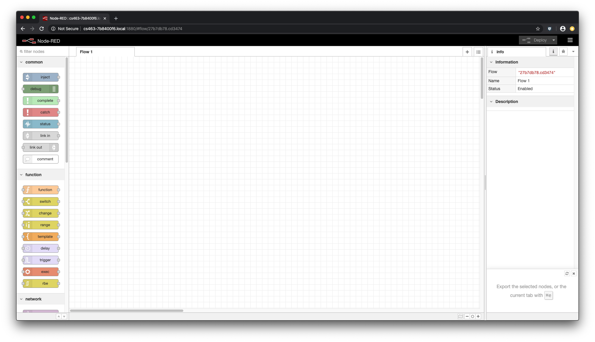

## <a name="7"></a> Enable Password Authentication on Node-Red

By default, Node-Red editor is fully opened.  You can enable password authenticate to the editor:

- Stop Node-Red service.

```
sudo systemctl stop node-red
```


- Install Node-Red admin module.

```
sudo npm install -g node-red-admin
```
- Hash you password with `node-red-admin hash-pw`.  Enter the password you would like to set and obtain an hashed value.

```
cs463-7b8400f6:~/.node-red$ node-red-admin hash-pw
Password: 
$2a$08$9zrsysmnmejJ4K39mOBpzerIxyxWh.lvGSDFglGi9xi.akZS9ScDa
cs463-7b8400f6:~/.node-red$ 

```
- Enable password authentication on Node-Red by editing the settings.js file `nano ~/.node-red/settings.js`.  Replace the password with the hashed value being generated.

``` 
adminAuth: {
        type: "credentials",
        users: [{
            username: "admin",
            password: "$2a$08$9zrsysmnmejJ4K39mOBpzerIxyxWh.lvGSDFglGi9xi.akZS9ScDa",
            permissions: "*"
        }]
    },
```
- Start the Node-Red service again.

```
sudo systemctl start node-red
```

If you open the Node-Red URL again, you should see authentication will be required.

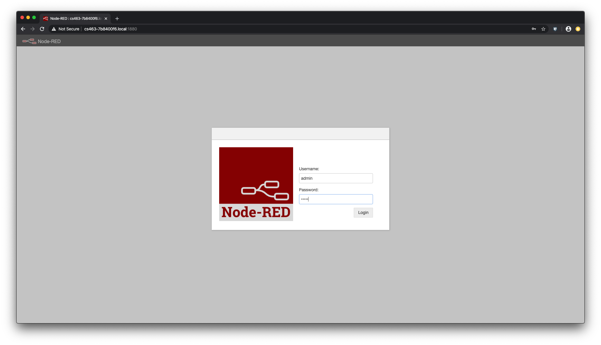

## <a name="8"></a> Debug Javascript Function Node in Chrome Browser

Node-Red is built on Node.js so you can do debugging on function node also.

Let say if you have a function node with some Javascript code inside.  You can insert the `debugger` statement into the code as breakpoint so that Chrome can attach to the target app and break at the specific point.

- Launch the Node-Red editor.
- Insert `debugger` statements into you Javascript code as breakpoints.

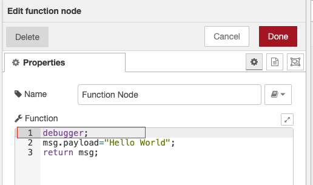

- Launch a new Chrome window and type in `chrome://inspect` on the URL.  Identify your reader on the list and click on inspect


- A dediated debugger window will be launched.  The flow will continue to execute until you hit the debugger statement within the flow, where the app will halt.

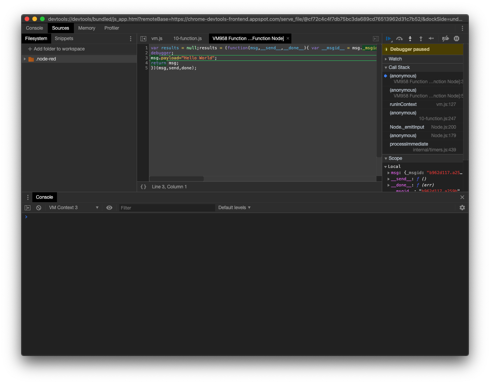

## <a name="9"></a> Install Eclipse Mosquitto MQTT Broker on the Reader

Node-Red provide native support to MQTT, where you can subscribe/publish to specific topics on a remote broker.  In case if you would like to use CS463 as a MQTT broker for consolidating and processing various sensor data, you can install Eclipse Mosquitto broker on the reader.

- Install package from the repository with `sudo dnf install mosquitto`:

```
cs463-7b8400f6:~$ sudo dnf install mosquitto
Password: 
Last metadata expiration check: 13:53:57 ago on Tue Mar 10 15:59:56 2020.
Dependencies resolved.
======================================================================================================================================================================================================
 Package                                        Arch                                               Version                                         Repository                                    Size
======================================================================================================================================================================================================
Installing:
 mosquitto                                      imx6dlsabresd                                      1.6.8-1                                         cslrepo                                      666 k

Transaction Summary
======================================================================================================================================================================================================
Install  1 Package

Total download size: 666 k
Installed size: 1.7 M
Is this ok [y/N]: y
Downloading Packages:
mosquitto-1.6.8-1.imx6dlsabresd.rpm                                                                                                                                   333 kB/s | 666 kB     00:02    
------------------------------------------------------------------------------------------------------------------------------------------------------------------------------------------------------
Total                                                                                                                                                                 330 kB/s | 666 kB     00:02     
Running transaction check
Transaction check succeeded.
Running transaction test
Transaction test succeeded.
Running transaction
  Preparing        :                                                                                                                                                                              1/1 
  Installing       : mosquitto-1.6.8-1.imx6dlsabresd                                                                                                                                              1/1 
  Verifying        : mosquitto-1.6.8-1.imx6dlsabresd                                                                                                                                              1/1 

Installed:
  mosquitto.imx6dlsabresd 1.6.8-1                                                                                                                                                                     

Complete!
cs463-7b8400f6:~$ 
```
- Create configuration file for the broker

```
sudo cp /etc/mosquitto/mosquitto.conf.example /etc/mosquitto/mosquitto.conf
```
- Add the default user for mosquitto and assign password

```
sudo /usr/sbin/adduser mosquitto
```
- Create service to start Mosquitto on start with `sudo nano /etc/systemd/system/mosquitto.service`:

```
[Unit]
Description=Mosquitto MQTT v3.1/v3.1.1 Broker
Documentation=man:mosquitto.conf(5) man:mosquitto(8)
After=network-online.target
Wants=network-online.target

[Service]
ExecStart=/usr/local/sbin/mosquitto -c /etc/mosquitto/mosquitto.conf
ExecReload=/bin/kill -HUP $MAINPID
Restart=on-failure

[Install]
WantedBy=multi-user.target
```
- Enable and start the Mosquitto service:

```
sudo systemctl enable mosquitto
sudo systemctl start mosquitto
```
## <a name="10"></a> Redirect Tag Data to MQTT Broker on Node-Red

By using Node-Red, you can easily create a flow for sending the tag data from the event engine to a local/remote MQTT broker.  Here are the steps required:

* Create a 4 node flow:
	* `http in` node to accept http post request from the event engine at the URL /SendTags
	* `http response` node for reporting the http responses
	* `mqtt out` node for publishing the JSON data to the topic `/message/events` on the local Mosquitto

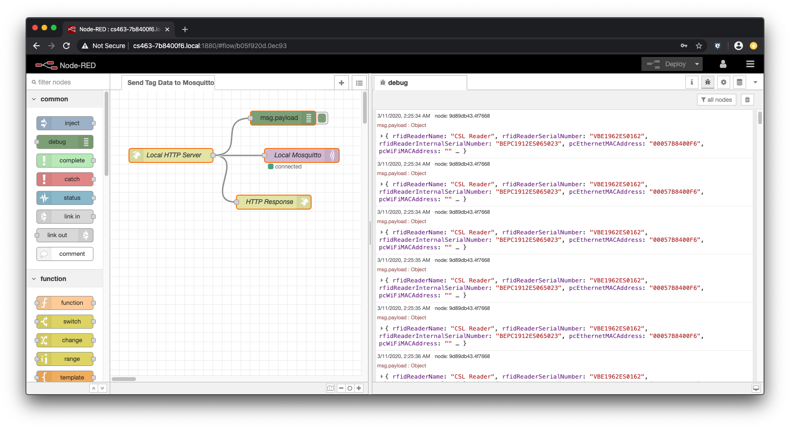

On your computer, you can also run a MQTT client and observe the tag data being published:

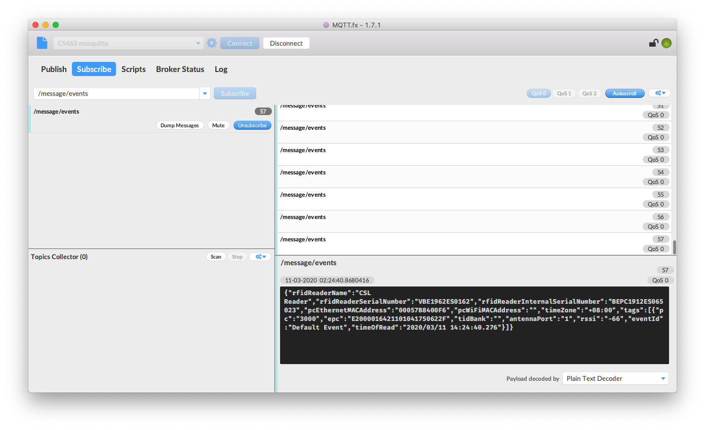

The following is the flow that you can import into Node-Red:

```
[{"id":"b05f920d.0ec93","type":"tab","label":"Send Tag Data to Mosquitto","disabled":false,"info":""},{"id":"437f60c0.5b773","type":"http in","z":"b05f920d.0ec93","name":"Local HTTP Server","url":"/SendTags","method":"post","upload":false,"swaggerDoc":"","x":130,"y":140,"wires":[["54cd608a.a6f09","f3844885.05dea8","9d89db43.4f7668"]]},{"id":"9d89db43.4f7668","type":"debug","z":"b05f920d.0ec93","name":"","active":true,"tosidebar":true,"console":false,"tostatus":false,"complete":"payload","targetType":"msg","x":370,"y":60,"wires":[]},{"id":"54cd608a.a6f09","type":"http response","z":"b05f920d.0ec93","name":"HTTP Response","statusCode":"","headers":{},"x":350,"y":240,"wires":[]},{"id":"f3844885.05dea8","type":"mqtt out","z":"b05f920d.0ec93","name":"Local Mosquitto","topic":"/message/events","qos":"0","retain":"false","broker":"7c2b8880.ca5908","x":410,"y":140,"wires":[]},{"id":"7c2b8880.ca5908","type":"mqtt-broker","z":"","name":"Local Mosquitto","broker":"127.0.0.1","port":"1883","clientid":"cs463-7b8400f6","usetls":false,"compatmode":false,"keepalive":"60","cleansession":true,"birthTopic":"","birthQos":"0","birthPayload":"","closeTopic":"","closeQos":"0","closePayload":"","willTopic":"","willQos":"0","willPayload":""}]
```