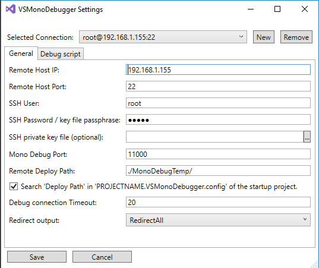
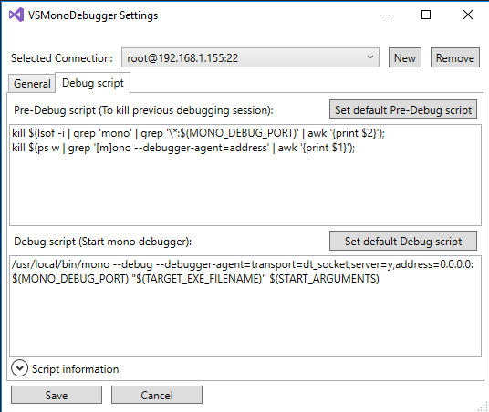
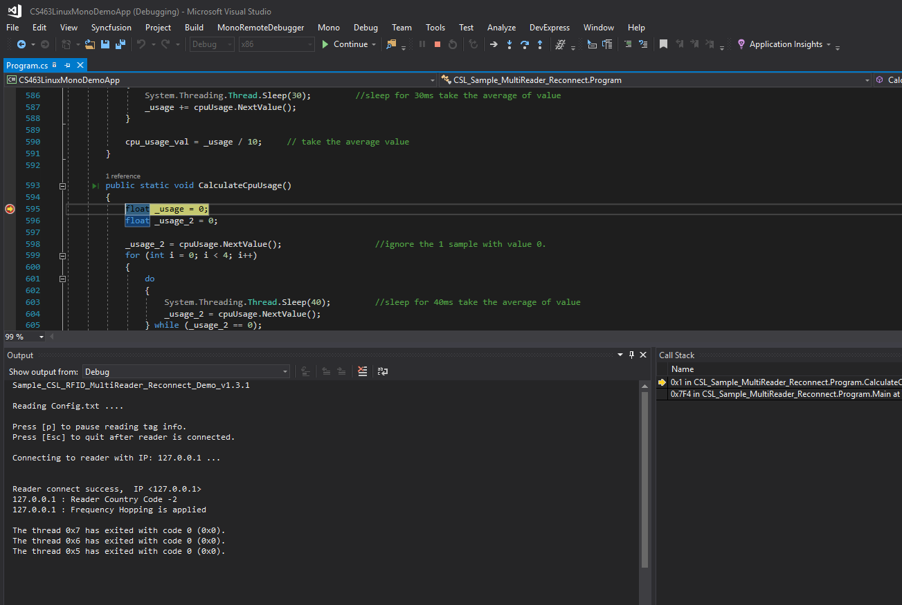

**Objectives:** 

* To demonstrates how to build your IoT apps using .NET/C#/CSLibrary
* To migrate your existing application built for CS203/CS468/CS469 with CSLibrary .NET assembly to the CS463
* To run you app on an external host (Windows/Linux/MacOS) or on the a


**Technical Level:** Intermediate/Advanced

**Prerequisits:**

* CS463 basic operations
* Modifiy the CS463 access mode 
* Basic knowledge of Linux terminal and commands
* C# programming with Visual Studio

> Note: We strongly recommended to review the the following information before proceeding to the steps as all users have full access to the device by default.  Make sure you know what you are doing.
>  
> 
> * [CS463 User's Manual](https://www.convergence.com.hk/downloads/cs463/)
> * [CS463 Getting Started Guide](../2020-03-26-cs463-getting-started)
> * [CS463 Configure your Edge Device for Hosting Custom Applications](../2020-03-26-cs463-edge-setup)

**Recipe:**

1. [Install Mono Runtime on CS463](#1) 
2. [Set up development environment in Visual Studio on the PC](#2)
3. [Deploy and debug app on the reader](#3)


## <a name="1"></a>Install Mono Runtime on CS463

Assume you have added the package reopository to the reader by following the guide [CS463 Configure your Edge Device for Hosting Custom Applications](../2020-03-26-cs463-edge-setup)


Install Mono runtime on your reader with the following command on Linux terminal:

```sudo dnf install mono```

Please acknowledge the installation so that Node.js will be installed to your reader.

You can check by typing the command *mono* at the terminal to verify.

```
> mono -V
Mono JIT compiler version 6.0.0.327 (tarball Fri Jan  3 18:53:38 UTC 2020)
Copyright (C) 2002-2014 Novell, Inc, Xamarin Inc and Contributors. www.mono-project.com
	TLS:           __thread
	SIGSEGV:       normal
	Notifications: epoll
	Architecture:  armel,vfp+hard
	Disabled:      none
	Misc:          softdebug 
	Interpreter:   yes
	LLVM:          supported, not enabled.
	Suspend:       preemptive
	GC:            sgen (concurrent by default)
```

## <a name="2"></a>Set up development environment in Visual Studio on the PC

- Log into the web interface of the reader and go to `System -> Access Mode`.  Change access mode to *CSL Unified API*.
- Download source code under the folder *CS463LinuxMonoDemoApp*
- Open the soluton file (.sln) using Visual Studio 2015 or later
- Edit the "Config.txt" file within the project.  If you are planning to deploy the app and run it on the reader, the IP address can stay as 127.0.0.1.  For port settings configurations, you can change the values within
- On Visual Studio, go to `Tools -> Extensions and Updates`.  From Microsoft Marketplace, download *Mono Tools* and install as an add-on
- You will find an additonal *Mono" menu item and go to *Settings..." under the menu
- Provide the ssh log-in information and the path where the app binary will be deployed (e.g. /user/root/MonoDebugTemp)
<br><br>




## <a name="3"></a>Deploy and debug app on the reader

- Select Mono->Deploy and Debug (SSH).  Visual Studio deploy the app to the reader and debug through SSH.  You can put in breakpoint and debug the code on the device line by line
<br><br>



