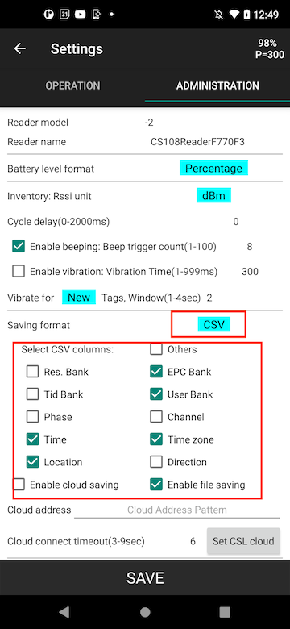
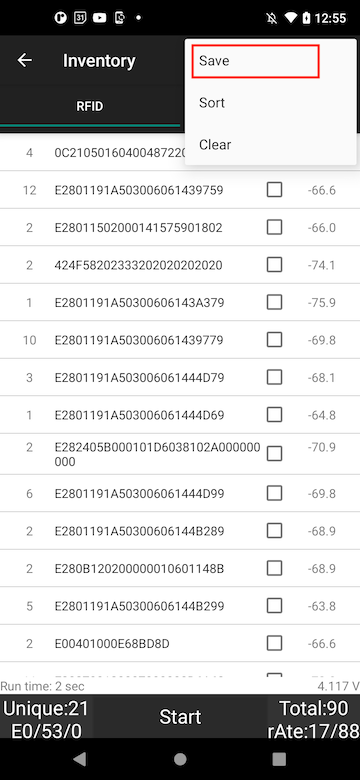
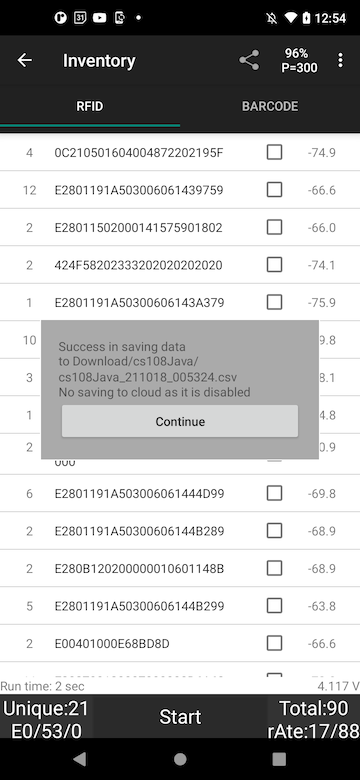
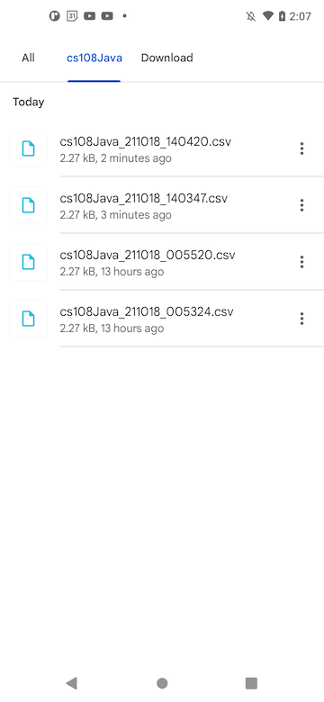
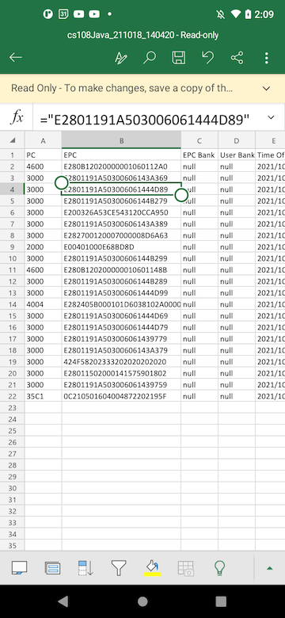
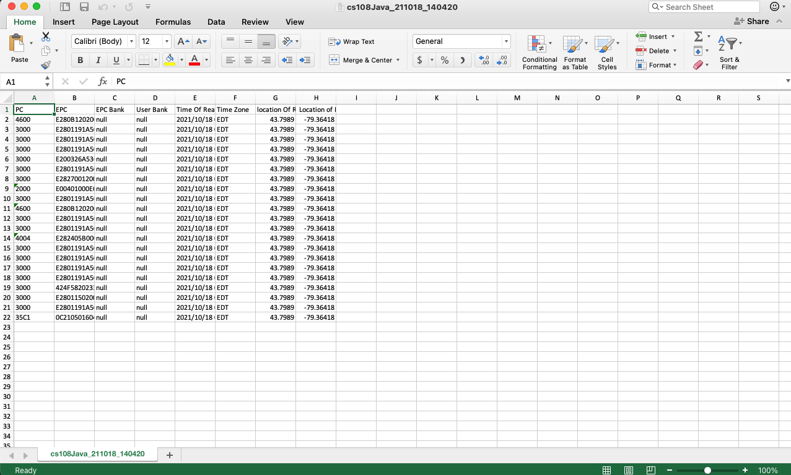

**Objectives:** 

* Save tag data to CSV format that can be imported directly into Excel spreadsheets

**Technical Level:** Beginner

**Prerequisits:**

* CS108 basic operations [CS108 User's Manual](https://www.convergence.com.hk/downloads/cs108/)
* CS108 Java Demo App v2.2.0 or later running on Android device
* Microsoft Excel Mobile on Android or Excel running on desktop

**Recipe:**

1. [Enable saving data to CSV and configure data format](#1)
2. [Save tag data to CSV file](#2)  
3. [Open CSV file with Excel Mobile on Android device](#3)
4. [Open CSV file with Excel on Windows desktop](#4)

### Enable saving data to CSV and configure data format

Go to Settings page to enable the file saving function (tick the `Enable file saving` box) and choose saving format to be CSV.

### Save tag data to CSV file

After inventory, click the triple dots on upper right corner and click `Save`.

Window pops up to show result of saving and the path of file.

Use file explorer or similar program to check the saved file.  Please note the path can be observed at the top of the file explorer app, it is in `/Download/cs108Java`, or similar paths in different phones.  The last part is always cs108Java. 

### Open CSV file with Excel Mobile on Android device

Using Excel Mobile to open the file.  

### Open CSV file with Excel on Windows desktop</a>

You can also copy the file to a PC and open it using Excel.

