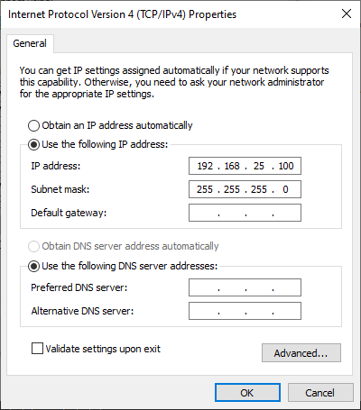
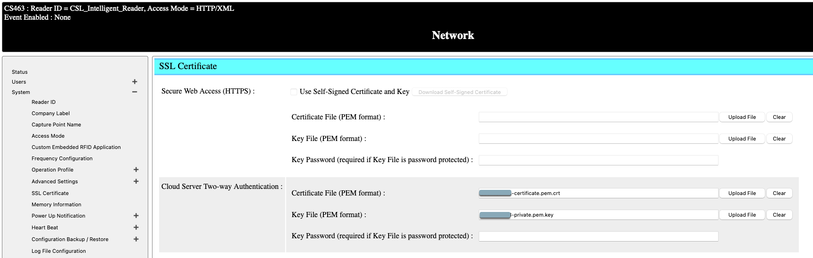
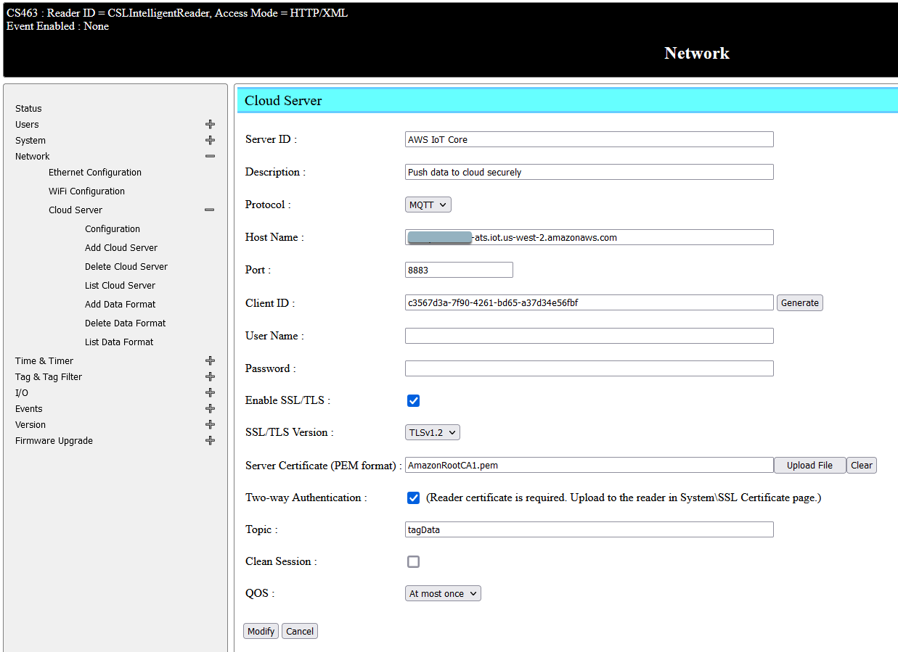
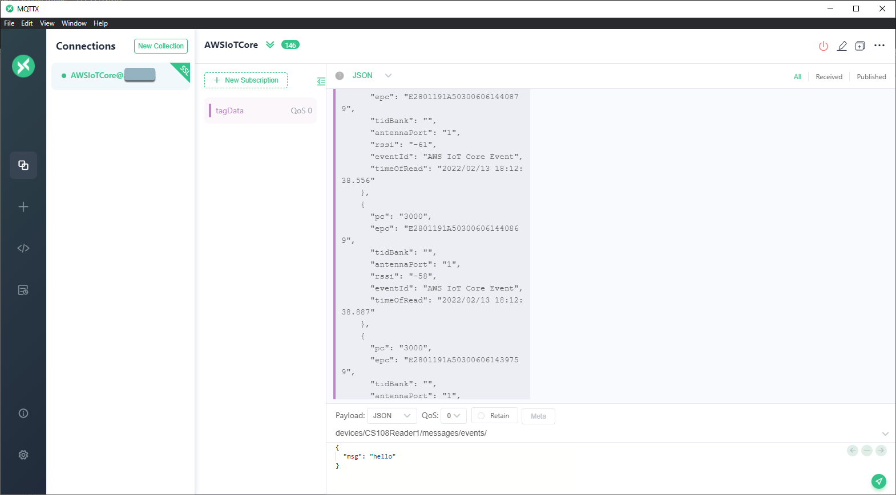

 

**Objectives:** 

* To connect your CS463 reader to AWS IoT Core out of the box

**Technical Level:** Beginner/Intermediate

**Prerequisits:**

* CS463 basic operations [[CS463 User's Manual](https://github.com/cslrfid/CS463-CS203X-Product-Downloads/raw/main/Manuals/CSL-Intelligent-Fixed-Reader-User-Manual.pdf)]
* Basic concepts of CS463 event engine
* Knowledge of changing network configurations on your Computer
* AWS IoT Core Instance Information:
	* Endpoint Address
	* Client Certification File
	* Client Key File
	* CA File 

	
**Recipe:**

1. [Unbox and Power up the Reader](#1)
2. [Access Web Interface and Restore the Aws IoT Core Configurations](#2)  
3. [Enable Event](#3)
4. [Build and Run the Demo App](#4)
5. [Confirm Data Sent to Cloud](#5)

##  Unbox and Power up the Reader

Unbox and power up the reader with the power supply.  Attach an antenna to port 0 of the reader and connect the reader to your PC with an Ethernet cable as shown on the picture below.

Assume you are running a Windows 10 PC.  Connect your reader directly to the network card that's on your PC.  Go to `Netowrk Status` and select `Change adapter options`.  Right click on the network interface card that connects to the reader and select `Properties`.  

Open up the properties of TCP/IPv4 and change the IP address of your network card.  By default, the reader is having IP address of 192.168.25.160.  You can change the IP address of your network card to be in the same subnet, such as 192.168.25.100.

##  Access Web Interface and Restore the Aws IoT Core Configurations

Download the AWS IoT Core configuration file [here](../files/CS463AWSIoTCoreConfig.json).

Open your browser and type in the IP address of the reader [http://192.168.25.160](http://192.168.25.160).  Log in with the default credential (User Name = root, Password = csl).  

You will need to connect your reader to the Internet so that it can send data to cloud.  A quick way will be enabling the WiFi interface of the reader and connect to your wireless routers and then disconnect your wired connection.  Otherwise, you can change the Ethernet IP address of reader to be in the same subnet of your network that have Internet access.  Go to `Network`->'Ethernet Configuration` and re-configure your IP address and then connect the reader back to your work.

Go to `System`->`Configuration Backup / Restore`->`Restore`.  Select the configuration file you downloaded from above.

Reader will reboot itself and that takes around 3 minutes to complete.  After that, you reader will be pre-configured for AWS IoT Core connectivity.

##  Configure your Cloud Server (AWS IoT Core Endpoint)

Go to `System`->`SSL Certificate` and under `Cloud Server Two-way Authentication`, enter:

* Certificate File (PEM format)
* Key File (PEM format)
* Key Password (if any)

Go to `Network`->`Cloud Server`->`List Cloud Server` and select `AWS IoT Core`.  Provide the following information by the minimal:

* Host Name: endpoint address of your AWS IoT Core instance
* Port: 8883 default for secure connection
* Client ID: can be entered manually or generated automatically
* Enable SSL/TLS
* Server Certification (PEM Format): provide the root CA of AWS services
* Enable Two-way Authentication
* Topic: provide a MQTT topic where the tag data will be published

##  Enable Event

Go to `Event`->`Event Management`->`List Event` and select `AWS IoT Core Event`.  Tick the `Enable Event` checkbox and click on `Modify`.  By this time, reader should start reading tag and send the received tag data to the cloud

##  Confirm Data Sent to Cloud

Open up your MQTT client.  Connect to the AWS IoT Core instance and subscribe to the topic.  You should see tag data being sent back in JSON format.

